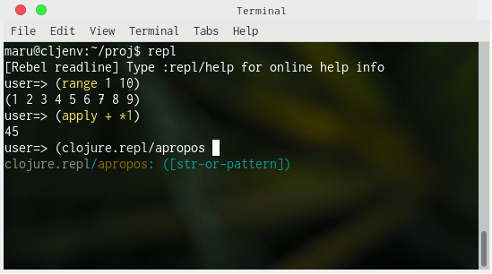
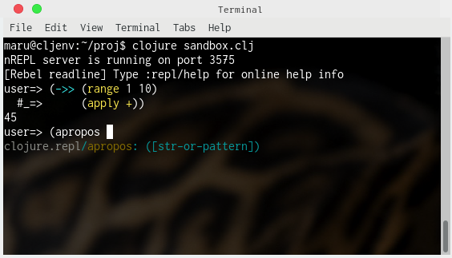

# doclj

Building a development environment for Clojure in a Docker container.

# Usage

## Build the image

    $ cd my-work
    $ git clone https://github.com/gpsoft/doclj.git
    $ cd doclj
    $ make image

This builds the docker image. Default name is `cljenvi`. You can change it by `IMAGENAME` env. variable like so:

    $ IMAGENAME=mycljimage make image

## Start dev

    $ cd my-work
    $ mkdir proj
    $ cd proj
    $ cp ../doclj/makefile .
    $ make dev

This brings you into the container. `cljenv` is the default name, which can be customized by `CONTAINERNAME` env. variable.

## About the container

- The maven repository(`~/.m2`) is shared with the host
- The working directory is `~/proj`, which is also shared with the host
- Exposed ports are 8080(web), 3000(another web), 3449(figwheel), 3575(nREPL)
- Standard tools --`lein`, `boot`, `clojure`, and `clj`-- are all available
- `repl` alias launches `rebel-readline`
- The hostname is same as the container's

## Sample sessions

### Leiningen

    huracan ~ $ cd ~/dev
    huracan ~/dev $ mkdir proj
    huracan ~/dev $ cd proj/
    huracan ~/dev/proj $ cp ../doclj/makefile  .
    huracan ~/dev/proj $ make dev
    maru@cljenv:~/proj$ ll
    total 4
    -rw-r--r-- 1 maru maru 810 Jun 14 14:56 makefile
    maru@cljenv:~/proj$ lein new app hello-lein
    Generating a project called hello-lein based on the 'app' template.
    maru@cljenv:~/proj$ cd hello-lein/
    maru@cljenv:~/proj/hello-lein$ lein run
    Hello, World!
    maru@cljenv:~/proj/hello-lein$ lein repl
    nREPL server started on port 3575 on host 0.0.0.0 - nrepl://0.0.0.0:3575
    REPL-y 0.3.7, nREPL 0.2.12
    Clojure 1.8.0
    OpenJDK 64-Bit Server VM 1.8.0_171-8u171-b11-1~deb9u1-b11
        Docs: (doc function-name-here)
              (find-doc "part-of-name-here")
      Source: (source function-name-here)
     Javadoc: (javadoc java-object-or-class-here)
        Exit: Control+D or (exit) or (quit)
     Results: Stored in vars *1, *2, *3, an exception in *e

    hello-lein.core=> 

You can connect to the nREPL server from the host through port 3575.

### Boot

    huracan ~/dev/proj $ make dev
    maru@cljenv:~/proj$ boot -u
    Retrieving maven-metadata.xml from https://repo.clojars.org/
    #http://boot-clj.com
    #Thu Jun 14 15:06:17 UTC 2018
    BOOT_CLOJURE_NAME=org.clojure/clojure
    BOOT_CLOJURE_VERSION=1.8.0
    BOOT_VERSION=2.7.2
    maru@cljenv:~/proj$ boot -d boot/new new -t app -n hello-boot
    Retrieving maven-metadata.xml from https://repo.clojars.org/
    Could not transfer metadata boot:new/maven-metadata.xml from/to clojars (https://repo.clojars.org/): GET request of: boot/new/maven-metadata.xml from clojars failed
    Retrieving maven-metadata.xml from https://repo.clojars.org/
    Could not transfer metadata boot:new/maven-metadata.xml from/to clojars (https://repo.clojars.org/): GET request of: boot/new/maven-metadata.xml from clojars failed
    Retrieving maven-metadata.xml from https://repo.clojars.org/
    Could not transfer metadata boot:new/maven-metadata.xml from/to clojars (https://repo.clojars.org/): GET request of: boot/new/maven-metadata.xml from clojars failed
    Generating a project called hello-boot based on the 'app' template.
    maru@cljenv:~/proj$ cd hello-boot/
    maru@cljenv:~/proj/hello-boot$ boot run
    Retrieving maven-metadata.xml from https://repo.clojars.org/
    Retrieving maven-metadata.xml from https://repo1.maven.org/maven2/ (5k)
    Retrieving maven-metadata.xml from https://repo.clojars.org/
    Could not transfer metadata adzerk:boot-test/maven-metadata.xml from/to clojars (https://repo.clojars.org/): GET request of: adzerk/boot-test/maven-metadata.xml from clojars failed
    Classpath conflict: org.clojure/clojure version 1.8.0 already loaded, NOT loading version 1.10.0-alpha4
    Hello, World!
    maru@cljenv:~/proj/hello-boot$ boot repl
    Retrieving maven-metadata.xml from https://repo.clojars.org/
    Retrieving maven-metadata.xml from https://repo1.maven.org/maven2/ (5k)
    Retrieving maven-metadata.xml from https://repo.clojars.org/
    Could not transfer metadata adzerk:boot-test/maven-metadata.xml from/to clojars (https://repo.clojars.org/): GET request of: adzerk/boot-test/maven-metadata.xml from clojars failed
    Classpath conflict: org.clojure/clojure version 1.8.0 already loaded, NOT loading version 1.10.0-alpha4
    nREPL server started on port 3575 on host 0.0.0.0 - nrepl://0.0.0.0:3575
    REPL-y 0.3.7, nREPL 0.2.12
    Clojure 1.8.0
    OpenJDK 64-Bit Server VM 1.8.0_171-8u171-b11-1~deb9u1-b11
            Exit: Control+D or (exit) or (quit)
        Commands: (user/help)
            Docs: (doc function-name-here)
                  (find-doc "part-of-name-here")
    Find by Name: (find-name "part-of-name-here")
          Source: (source function-name-here)
         Javadoc: (javadoc java-object-or-class-here)
        Examples from clojuredocs.org: [clojuredocs or cdoc]
                  (user/clojuredocs name-here)
                  (user/clojuredocs "ns-here" "name-here")
    hello-boot.core=> 

# Rebel-readline

# Clojure/Clj

    maru@cljenv:~/proj$ vim deps.edn
        {:deps {org.clojure/clojure {:mvn/version "1.9.0"}
                org.clojure/tools.nrepl {:mvn/version "0.2.12"}
                cider/cider-nrepl {:mvn/version "0.16.0"}
                com.bhauman/rebel-readline {:mvn/version "0.1.3"}}}

    maru@cljenv:~/proj$ vim sandbox.clj
        (in-ns 'user)

        (require '[clojure.repl :refer [doc apropos]]
                 '[clojure.pprint :refer [pprint pp]]
                 '[cider.nrepl :as cider]
                 '[clojure.tools.nrepl.server :as nrepl]
                 '[rebel-readline.main :as rebel]
                 '[clojure.java.io :as io])

        (defonce server
          (nrepl/start-server
            :handler cider/cider-nrepl-handler
            :bind "0.0.0.0"
            :port 3575))
        (let [port (:port server)]
          (spit ".nrepl-port" port)
          (println "nREPL server is running on port" port))

        (rebel/-main)

        (io/delete-file ".nrepl-port")

        (println "Bye!")
        (System/exit 0)

